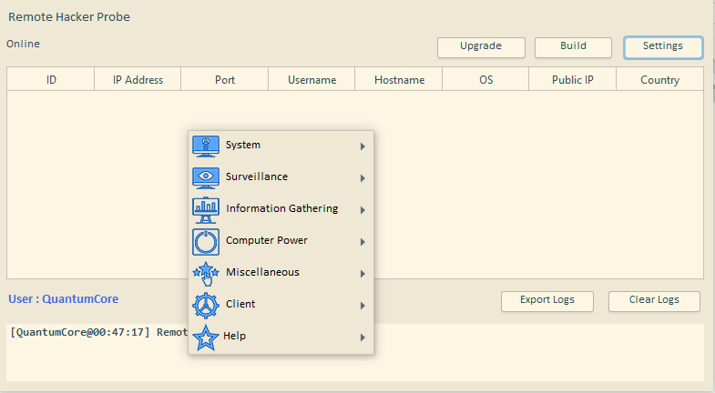
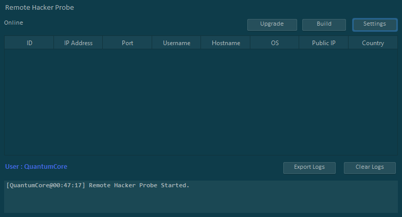
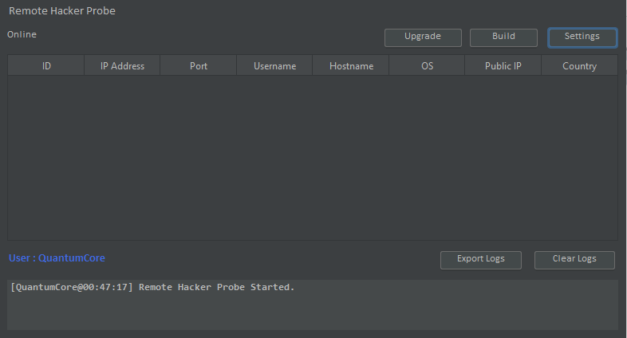
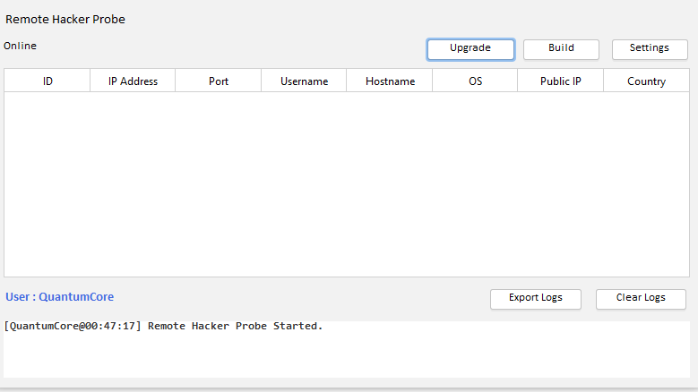
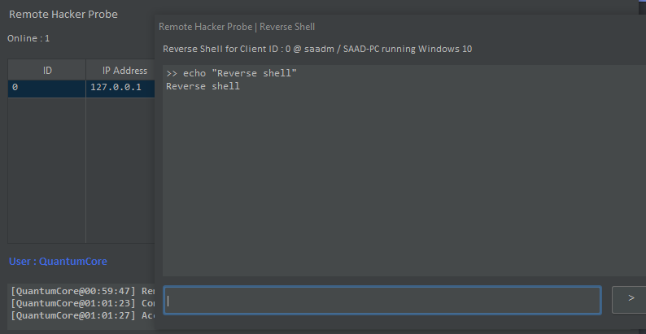

---

The Remote Hacker Probe is a Remote Access and Post Exploitation Framework coded in C++/Java.

---

### Installation & Usage
1. Download Java 11+.
2. Download the Zip Attached in the [Latest Release](https://github.com/quantumcored/remote_hacker_probe/releases).
3. Run the file run-on-*linux*.desktop OR run-on-*windows*.bat
4. [Getting Started with Remote Hacker Probe](https://quantumcored.com/index.php/2021/02/24/getting-started-with-the-remote-hacker-probe/).

---

### Server Features :
- Visually Appealing and Theme able Graphical User Interface featuring Dark, Light, Solarized Dark and Solarized Light themes.
- Built for ease and usability, Remote Hacker Probe is extremely easy to use and Set up.
- The Server is coded in Java meaning it is Cross Platform! It will run anywhere in a Java Runtime Environment (JRE).
- Event Logging.
- High Speed File Upload / Download.

---

### Main Features :
- Execute DLL’s in memory using Reflective DLL Injection over Socket.
- Download, Upload, Delete and browse the entire file System.
- Reverse Shell, Full Access to the command line.
- Scan Remote Network for hosts.
- Port scan hosts in the Target Network.
- Scan Remote Network for hosts vulerable to Eternal Blue.
- Get Process Information by Process name.
- Geolocate Client using IP Address on an interactive Map.
- Shutdown / Restart the Remote PC.
- Grab screenshot of the Remote PC.
- Record Microphone input.
- Add to Startup Persistence on command.
- Display Message box.
- Open URLS in the default browser.
- USB Infection.
- Active Window logging. 
- Client Path.
- Keylogger. 
- Password Recovery.
  - Pidgin.
  - FileZilla.
  - Vault & IE.
  - WinSCP.
  - WiFi.
  - Credential Manager.
- Task Manager.

---

### Bugs

#### Remote Shell Upload Vulnerability in RHP Server.
This also has a working exploit and may be exploited in the wild. I'm currently fixing this and will publish the patch in a day or so. 
The vulnerability was reported by a Random user who found RHP via a share on Reddit. While he was able to write the exploit using the Screenshot command.
RCE and Shell / Payload upload can also be done using many other commands. 

The exploit works by connecting to the RHP Server impersonating to be the Probe. And Triggers 'SCREENSHOT' Upload to upload a modified backdoored version of RHP.jar ( Server.java modified and rebuilt ). After it's uploaded the Impersonator spams the RHP Server causing it to crash. Once it's re run, the modified version of RHP is run giving Access to your computer.

**Temporary fix**, Don't expose RHP Server to the internet, If your RHP Server crashes after getting a lot of clients at once. Do not re run. 

---

### Screenshots

#### Developer
Hi my name's [Fahad](https://github.com/quantumcore).
You may contact me, on [Discord](https://discordapp.com/invite/8snh7nx) or [My Website](https://quantumcored.com/)

#### LICENSE
[VIEW LICENSE](https://github.com/quantumcored/remote_hacker_probe/blob/main/LICENSE) 

The Developer is not responsible for any misuse or Damage caused by the program. This is created only to innovate InfoSec and **YOU**. :point_left:

#### Donate
Help me with my future projects. Thank you.
[Donate with Crypto](https://commerce.coinbase.com/checkout/cebcb394-f73e-4990-98b9-b3fdd852358f)
